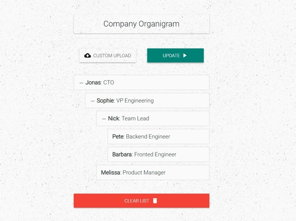

# React Nestable List

Nestable drag & drop list with React and Redux.

## App Description

This app shows a list of employees representing employee -> supervisor relationship in a company.

The user needs to upload a structured JSON file to get nested employee -> supervisor list. Since there's no server-side code for this application, the uploaded file will be saved in localstorage & will be deleted upon clearing the list.



## Tools used

- create-react-app, redux, react-redux

- Additional packages: classnames, immutability-helper

## Getting started

To run the app: clone the repo & install the dependencies

```shell
> git clone https://kukiron@bitbucket.org/kukiron/react-nestable-list.git
> cd react-nestable-list
> npm install
> npm start
```

To run the app inside a docker container

```shell
> docker-compose up -d --build
```

In either case, head to `localhost:3000` once the build is finished
