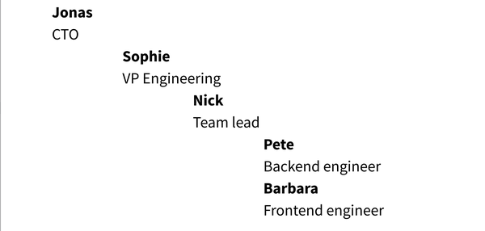

# Front-end Development Task

## Ever changing company hierarchy

### Introduction

Help HR manager Personia get a grasp of her ever changing company’s hierarchy! Every week Personia receives a JSON of employees and their supervisors from her demanding CEO Chris, who keeps changing his mind about how to structure his company. Chris wants this JSON to be visualized, so that he can better see the employees hierarchy

### To make her life easier, Personia wants to have the following

- Personia would like to upload a JSON file, Chris provides her with, to the application

- This JSON represents an Employee -> Supervisor relationship with additional information about employees. Example file is available [here](https://drive.google.com/file/d/14lTQV9ddSRXkyB_l_baQRzuLzlDNbo09/view?usp=sharing). In the example, Nick is a supervisor of Pete and Barbara, and Sophie supervises Nick

- As a result of uploading the JSON file, Personia would like to see and “organigram” of the provided company hierarchy, where the most senior employee is on the top of the hierarchy, and his employees are on the bottom. This organigram should be displayed in a form of a nested list. Each node of the organigram should contain employee’s position. Example output:

- Each subtree of the organigram should be collapsable

- Personia also often gets a task from Chris to rearrange the diagrams he gives to her. To help her with this task, she would like the nodes of the tree to be rearrangeable with drag and drop. E.g. if she picks up Pete and drops him on the same level as Nick, Pete and Nick become direct employees of Sophie

- We assume that the employee names are unique and the input hierarchy is valid. This means, there is always one boss on the top and the hierarchy does not contain loops (unless you want to do a bonus point)

### Example JSON file structure

Example JSON file can be downloaded [here](https://drive.google.com/file/d/14lTQV9ddSRXkyB_l_baQRzuLzlDNbo09/view?usp=sharing)

### Bonus points

- Personia would be especially happy if you would be able to detect loops or multiple “bosses” (top level employees) and alert her with an error message

- Provide a set of unit / integration tests (any testing library can be chosen)

### Nonfunctional requirements

- Use react.js to accomplish the task. If needed, you can choose a set of accompanying libraries only for state management, routing and drag and drop

- Please, do not use tree rendering libraries for react. It would be great to see which components you would create yourself to tackle the task

- App should be built using DOM elements only (no canvas)

### What has to be delivered

- Instructions on how to bootstrap your app. Ideally the app is served from within a docker container which has everything needed to start your application

- A link to a private Git repository (please, do not use public git repos) with the solution or an archive that contains a .git folder

- Best would be to have a commit history that represents your natural working process (so, if possible, no history rewrites / rebases)

### What do we look at when checking out the solution

- UI/UX and aesthetics

- Functionality

- Code quality

- Architecture

- Documentation

- Main thing - have fun!
